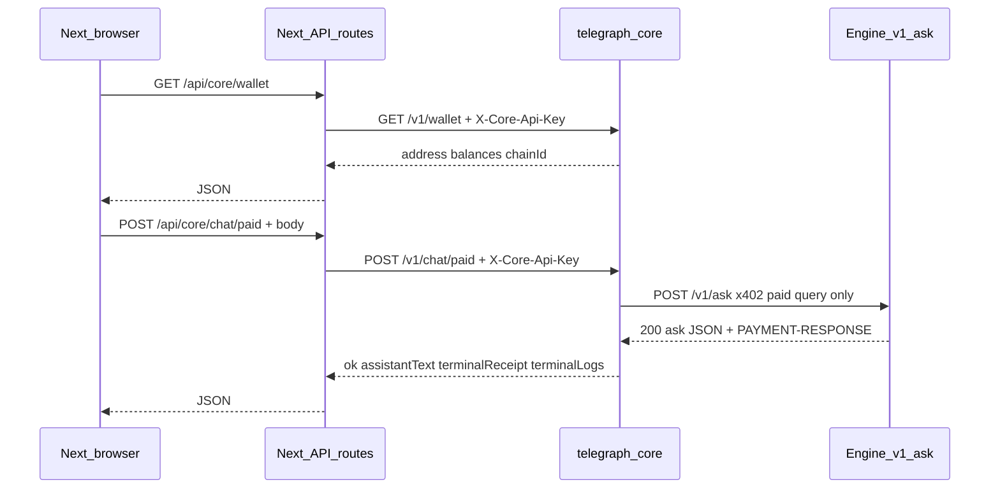

# Core (NestJS) + custodial x402 + GlobalWallet

This document is the **canonical architecture** for moving **x402 payment and paid chat** off the browser and into **`telegraph-core`**, a NestJS service that holds a **single custodial EVM key** (“Global wallet”). The Next app **`telegraph-terminal`** has **no wagmi**, **no WalletConnect**, and **no user signing**; it shows **GlobalWallet** (address + balances) and sends chat turns to Core via a **server-side Next proxy** so secrets stay off the client.

For historical context on the old **browser** x402 path, see [x402-integration.md](./x402-integration.md) (that flow has been removed from the codebase).

## Goals

- **One custodial wallet** on the server (Core) pays x402 for the engine **`POST /v1/ask`** HTTP resource (auto-routing).
- **Latest user message only** is sent as `{ query }` to the engine ask API in v1 (full thread stays in the UI for display only).
- **Intelligence Terminal**: user sends → **one** browser call to Next **`POST /api/core/chat/paid`** → Core runs paid `fetch` against the engine → UI receives **`assistantText` + `terminalReceipt` + `terminalLogs`**.
- **GlobalWallet** UI on **Kraken dashboard** and **Intelligence Terminal** top nav, fed by **`GET /api/core/wallet`** (proxied to Core **`GET /v1/wallet`**).
- **Engine WebSocket** is still used when **`NEXT_PUBLIC_USE_TERMINAL_BACKEND_X402`** is **false** (legacy engine-only live chat).

## Architecture



## telegraph-core (NestJS)

**Location:** [`telegraph-core/`](../telegraph-core/) (sibling to `telegraph-terminal/`).

**Stack:** Nest 10, `@nestjs/config` + **zod** validation, `@nestjs/throttler`, **`@x402/fetch` + `@x402/evm` + viem** for the same paid-fetch pattern as the former browser code.

### HTTP API (global prefix `/v1`)

| Method | Path | Auth | Purpose |
|--------|------|------|---------|
| `GET` | `/v1/health` | none | Liveness |
| `GET` | `/v1/wallet` | `X-Core-Api-Key` or `Authorization: Bearer` | Global wallet **address**, **chainId**, **native** balance, optional **USDC** if `CORE_USDC_ADDRESS` set |
| `POST` | `/v1/chat/paid` | same | Body **`{ messages, model? }`**. Latest **user** message → engine **`{ query }`**. Returns **`{ ok, assistantText?, terminalReceipt?, terminalLogs?, error? }`** |

### Core environment variables

See [`telegraph-core/.env.example`](../telegraph-core/.env.example). Critical entries:

| Variable | Role |
|----------|------|
| `CORE_EVM_PRIVATE_KEY` | `0x` + 64 hex — **secret**; never log or expose |
| `CORE_API_KEYS` | Comma-separated keys for `X-Core-Api-Key` / Bearer |
| `CORE_EVM_RPC_URL` | HTTP RPC for signing + balance reads |
| `ENGINE_BASE_URL` | Engine HTTP base (e.g. `http://127.0.0.1:7044`); align with terminal `ENGINE_INTERNAL_URL` |
| `ENGINE_ASK_PATH` | Default `/v1/ask` |
| `TELEGRAPH_BASE_URL` | Deprecated fallback if `ENGINE_BASE_URL` unset |
| `X402_PREFERRED_EVM_CHAIN_ID` | Must match an `accepts` rail (e.g. `84532`) |
| `X402_CHAT_MODEL` | Reserved for future direct subnet ask |
| `CORE_USDC_ADDRESS` | Optional USDC contract for balance display |
| `MIN_PRICE_USDC` | Receipt **cost hint** when engine omits `cost_usd` |

### Security checklist

- **Never** ship `CORE_EVM_PRIVATE_KEY` to the browser or commit it.
- **Protect** `POST /v1/chat/paid` and **`GET /v1/wallet`** with **`CORE_API_KEYS`** (empty list = guard rejects all).
- **Next.js** holds **`TERMINAL_BACKEND_API_KEY`** and **`TERMINAL_BACKEND_INTERNAL_URL`** only on the **server**; the browser calls **`/api/core/*`** without a public API key.
- Prefer **HTTPS** and **log redaction** for chat transcripts (Core receives full threads but only forwards latest user text to the engine in v1).
- Production: HSM/Vault for keys, rate limits, monitoring of float and failed 402s.

### Run locally

```bash
cd telegraph-core
cp .env.example .env
# set CORE_EVM_PRIVATE_KEY, ENGINE_BASE_URL, CORE_EVM_RPC_URL, CORE_API_KEYS
npm install
npm run start:dev
# listens on PORT (default 3030), routes under /v1
```

Smoke:

```bash
curl -sS -H "X-Core-Api-Key: dev-local-key" http://127.0.0.1:3030/v1/wallet | jq .
```

## telegraph-terminal (Next.js)

### Feature flag

| Variable | Role |
|----------|------|
| `NEXT_PUBLIC_USE_TERMINAL_BACKEND_X402` | When **`true`**, [`use-live-executor.ts`](../src/lib/hooks/use-live-executor.ts) uses **Core paid chat** and **Core wallet readiness** instead of engine WS for sends. |
| `TERMINAL_BACKEND_INTERNAL_URL` | Server-only: Core base URL (default `http://127.0.0.1:3030`) |
| `TERMINAL_BACKEND_API_KEY` | Server-only: must match one of `CORE_API_KEYS` on Core |
| `ENGINE_INTERNAL_URL` | Server-only: engine base for `/api/engine/*` (subnet list, future direct ask) |

See [`.env.example`](../.env.example).

### Paid chat v1 limitations

- **Auto routing only**: subnet picker disables per-subnet selection when paid chat is on; forced subnet send is blocked with a clear error.
- **Solana**: not supported for Terminal Backend paid chat in this build.

### Next proxy routes

- [`src/app/api/core/wallet/route.ts`](../src/app/api/core/wallet/route.ts) → Core `GET /v1/wallet`
- [`src/app/api/core/chat/paid/route.ts`](../src/app/api/core/chat/paid/route.ts) → Core `POST /v1/chat/paid`

### UI

- [`GlobalWallet`](../src/components/global-wallet.tsx) — polls **`/api/core/wallet`**; shown when `NEXT_PUBLIC_USE_TERMINAL_BACKEND_X402=true` in [`top-nav.tsx`](../src/components/top-nav.tsx) and [`src/app/page.tsx`](../src/app/page.tsx).
- **Sidebar** footer uses optional **`walletFooter`** from the live executor when Core mode is on.
- **Terminal receipt** panel shows engine-routed `subnet_name`, `cost_usd`, `reasoning`, `intent`, and x402 settlement when headers expose it.

### FAQ: does x402 include the chat message?

**Yes.** The paid resource is the engine **`POST /v1/ask`** with JSON **`{ query }`** (latest user text). Core mirrors the **single** paid HTTP request server-side; settlement metadata comes from x402 response headers.

## Related documents

- [daemon-integration.md](./daemon-integration.md) — Engine HTTP + WS (used when Core paid chat is off).
- [x402-integration.md](./x402-integration.md) — **Deprecated** browser wagmi path (removed from code; kept for history).
