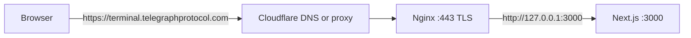

# Deploying the Terminal Frontend with Nginx and HTTPS

A walkthrough of what we did to put **telegraph-terminal** (Next.js) on **https://terminal.telegraphprotocol.com**, and why each step matters. Written so you can repeat this on another server or domain.

---

## 1. What problem we were solving

**Goal:** Users should open `https://terminal.telegraphprotocol.com` in a browser and see the Next.js app.

**Reality on the server:**

- The app runs as **Next.js** and listens on **port 3000** (e.g. `next-server` after `npm run build` + `npm run start`).
- Browsers expect **HTTPS on port 443**, not `http://your-ip:3000`.
- You usually do **not** expose port 3000 directly to the internet.

So we put a **reverse proxy** (Nginx) in front:

```text
Browser  →  HTTPS :443  →  Nginx  →  HTTP :3000  →  Next.js
```

DNS (`terminal.telegraphprotocol.com` → server IP) was already set. Our job was **Nginx + TLS**, not changing the app code.

---

## 2. Architecture (big picture)



| Piece | Role |
|--------|------|
| **Next.js on 3000** | Serves HTML, JS, and API routes (`/api/engine/*`, etc.) |
| **Nginx** | Terminates HTTPS, forwards requests to 3000, can host many domains on one machine |
| **Let’s Encrypt (Certbot)** | Free TLS certificates and auto-renewal |
| **Cloudflare** (optional) | DNS and/or CDN; your responses showed `server: cloudflare` |

**Important:** Nginx does **not** run your app. It only **forwards** traffic. The app must already answer on 3000 before Nginx can help.

---

## 3. What we verified first (don’t skip this)

Before touching Nginx, we confirmed the app works **without** the domain:

```bash
curl -sS -o /dev/null -w "%{http_code}\n" http://127.0.0.1:3000/
# Expected: 200

sudo ss -tlnp | grep ':3000'
# Expected: next-server listening on 3000
```

**Why:** If 3000 is down, Nginx will return **502 Bad Gateway** and you’ll waste time debugging TLS/DNS. Always test the **upstream** (Next) first.

**Practice:** Separate problems — *app broken* vs *proxy broken* vs *DNS broken*.

---

## 4. How Nginx is organized on Ubuntu

| Path | Meaning |
|------|---------|
| `/etc/nginx/nginx.conf` | Main config; usually **don’t** put your site here |
| `/etc/nginx/sites-available/` | One file per site (config **stored** here) |
| `/etc/nginx/sites-enabled/` | Symlinks to enabled sites (what Nginx **loads**) |

We **added a new file** instead of editing `default` or `api.msgscan.com`:

```text
/etc/nginx/sites-available/terminal.telegraphprotocol.com
/etc/nginx/sites-enabled/terminal.telegraphprotocol.com  → symlink
```

**Why a separate file?**

- **Isolation:** Terminal rules don’t mix with `api.msgscan.com` (which proxies to port 7044).
- **Safety:** Easier to enable/disable one site (`rm` symlink) without breaking others.
- **Clarity:** `server_name` tells Nginx which block to use per hostname.

Nginx chooses a `server` block using the HTTP **Host** header (e.g. `Host: terminal.telegraphprotocol.com`).

---

## 5. Step-by-step: what we did and why

### Step A — Inspect existing setup

```bash
which nginx
sudo systemctl status nginx
ls /etc/nginx/sites-available/
ls /etc/nginx/sites-enabled/
sudo cat /etc/nginx/sites-available/api.msgscan.com
```

**Why:** Copy patterns that already work on this machine (Certbot paths, `proxy_set_header`, etc.). Avoid duplicating a domain that might already exist.

---

### Step B — Create HTTP-only vhost (port 80)

We created `/etc/nginx/sites-available/terminal.telegraphprotocol.com`:

```nginx
server {
    listen 80;
    server_name terminal.telegraphprotocol.com;

    location / {
        proxy_pass http://127.0.0.1:3000;
        proxy_http_version 1.1;
        proxy_set_header Host $host;
        proxy_set_header X-Real-IP $remote_addr;
        proxy_set_header X-Forwarded-For $proxy_add_x_forwarded_for;
        proxy_set_header X-Forwarded-Proto $scheme;
    }
}
```

| Directive | Why it matters |
|-----------|----------------|
| `server_name` | Only this hostname uses this block |
| `proxy_pass http://127.0.0.1:3000` | Forward to Next on the same machine |
| `Host $host` | Next sees the public hostname (important for URLs/cookies) |
| `X-Forwarded-Proto $scheme` | App knows the client used HTTPS **after** Certbot adds SSL |
| `X-Real-IP` / `X-Forwarded-For` | App/logs see the real client IP, not only 127.0.0.1 |

We used **127.0.0.1** (loopback), not the public IP, so traffic stays on the server and doesn’t hairpin through the internet.

**Why HTTP first?** Certbot’s `--nginx` plugin needs to reach your server on port 80 to prove you control the domain (HTTP-01 challenge), unless you use DNS challenges.

---

### Step C — Enable the site and reload Nginx

```bash
sudo ln -sf /etc/nginx/sites-available/terminal.telegraphprotocol.com \
            /etc/nginx/sites-enabled/terminal.telegraphprotocol.com
sudo nginx -t && sudo systemctl reload nginx
```

| Command | Why |
|---------|-----|
| `ln -sf ... sites-enabled` | “Turn on” this vhost |
| `nginx -t` | Validate **all** configs before applying — catches typos |
| `systemctl reload nginx` | Apply config **without** dropping all connections (graceful) |

**Good practice:** Never `reload` if `nginx -t` fails. The old config keeps running.

**Good practice:** Prefer **`reload`** over **`restart`** for Nginx when only config changed.

We did **not** edit `api.msgscan.com`, so that service kept proxying to its own upstream.

---

### Step D — Test the proxy (before HTTPS)

```bash
curl -sS -o /dev/null -w "http_code=%{http_code}\n" \
  -H "Host: terminal.telegraphprotocol.com" http://127.0.0.1/
```

**Why the `Host` header?** Hitting `http://127.0.0.1/` without `Host` might match the `default` server block, not the terminal block. The header simulates a real browser request to your domain.

Expected: **200**.

---

### Step E — HTTPS with Certbot

```bash
sudo certbot --nginx -d terminal.telegraphprotocol.com
```

Certbot:

1. Obtains a certificate from Let’s Encrypt.
2. Writes files under `/etc/letsencrypt/live/terminal.telegraphprotocol.com/`.
3. **Edits** the Nginx site file to add `listen 443 ssl`, certificate paths, and usually HTTP → HTTPS redirect.

Your server already used Certbot for `api.msgscan.com`, so the same workflow applied.

**Good practice:** Let Certbot manage SSL lines (`# managed by Certbot`) so renewals stay consistent.

**Renewal:** Certbot installs a timer/cron; certificates auto-renew before expiry (yours: ~2026-08-14).

---

### Step F — Final verification

```bash
curl -sS -o /dev/null -w "https_code=%{http_code}\n" https://terminal.telegraphprotocol.com/
curl -sSI https://terminal.telegraphprotocol.com/ | head -8
```

We saw **HTTP/2 200** and Next.js headers (`x-nextjs-cache`, etc.) — proof the full chain works.

---

## 6. Good practices we applied (checklist for next time)

### 6.1 Test upstream before the proxy

```bash
curl http://127.0.0.1:APP_PORT/
```

### 6.2 One site per file + `server_name`

Don’t cram unrelated domains into one `server` block.

### 6.3 Always run `nginx -t` before reload

```bash
sudo nginx -t && sudo systemctl reload nginx
```

### 6.4 Don’t break existing sites

- Add new files under `sites-available/`.
- Only symlink the new site into `sites-enabled/`.
- Read existing configs before editing.

### 6.5 Use loopback for upstream on the same host

`proxy_pass http://127.0.0.1:3000` — not the public IP.

### 6.6 Set forwarding headers

So the app knows scheme, host, and client IP behind a proxy.

### 6.7 TLS via Let’s Encrypt + Certbot

Free, automated, widely trusted. Choose **redirect HTTP → HTTPS** in production.

### 6.8 Expose only 80/443 publicly

Keep **3000** on localhost or a locked security group when possible. Your `ss` output showed `*:3000` (all interfaces); tightening to `127.0.0.1:3000` is safer if the AWS security group allows 3000 from the internet.

### 6.9 Separate “site works” from “app features work”

- **This guide:** homepage loads over HTTPS (Nginx + Next on 3000).
- **Later:** chat, engine API, WebSockets need correct `.env`, engine on 8080, optional `/ws` in Nginx — different layer.

### 6.10 Production Next.js

On the server you typically run:

```bash
npm ci
npm run build
PORT=3000 npm run start
# or pm2/systemd for restarts on reboot
```

`NEXT_PUBLIC_*` env vars are baked in at **build** time; change `.env` → rebuild.

---

## 7. Common errors and what they mean

| Symptom | Likely cause |
|---------|----------------|
| **502 Bad Gateway** | Next not running on 3000, or wrong `proxy_pass` port |
| **404** from Nginx | Wrong `server_name` or request hit `default` server |
| `nginx -t` fails | Syntax error in new file; fix before reload |
| Certbot fails | DNS not pointing to this server, port 80 blocked, or wrong domain |
| Site works on server, not laptop | DNS propagation, Cloudflare SSL mode, or firewall |
| Mixed content in browser | Page is HTTPS but JS calls `http://...` — fix `NEXT_PUBLIC_*` URLs |

---

## 8. Cheat sheet: do it again on a new domain

1. Run app on a port: `curl http://127.0.0.1:PORT/` → 200.
2. Create `/etc/nginx/sites-available/NEW.domain` with `server_name` + `proxy_pass`.
3. `sudo ln -s` into `sites-enabled/`.
4. `sudo nginx -t && sudo systemctl reload nginx`.
5. Test: `curl -H "Host: NEW.domain" http://127.0.0.1/`.
6. `sudo certbot --nginx -d NEW.domain`.
7. `curl https://NEW.domain/` → 200.

---

## 9. What we intentionally did *not* cover here

These are **separate** from “frontend on 3000 + HTTPS”:

- Proxying **WebSocket** (`/ws`) to the engine on 8080
- Changing `NEXT_PUBLIC_USE_TERMINAL_BACKEND_X402` or engine env
- Running or configuring the Go engine (8080) or daemon (8081)
- `telegraph-core` on 3030

Your lead may ask for those next; they build on this same Nginx pattern (`location /ws` + `Upgrade` headers).

---

## 10. Glossary

| Term | Meaning |
|------|---------|
| **Reverse proxy** | Server that accepts client requests and forwards them to another service |
| **Upstream** | The backend Nginx forwards to (here: Next on 3000) |
| **vhost** | Virtual host — one Nginx `server { }` for a hostname |
| **TLS / SSL** | Encryption for HTTPS |
| **Let’s Encrypt** | Free certificate authority |
| **Certbot** | Tool to get and install certificates, often with Nginx |
| **Termination** | Nginx decrypts HTTPS; upstream can use plain HTTP on localhost |

---

## 11. Reference: your server outcome

| Item | Value |
|------|--------|
| Domain | `terminal.telegraphprotocol.com` |
| Server | `13.237.89.59` (AWS) |
| App | Next.js on port **3000** |
| Config file | `/etc/nginx/sites-available/terminal.telegraphprotocol.com` |
| Certificate | `/etc/letsencrypt/live/terminal.telegraphprotocol.com/` |
| Other site (unchanged) | `api.msgscan.com` → `localhost:7044` |
| Verified | `curl https://terminal.telegraphprotocol.com/` → **200** |

---

*If you extend this setup (WebSockets, engine proxy paths), add a new section or doc rather than overloading this one — keeps each document one clear responsibility.*
