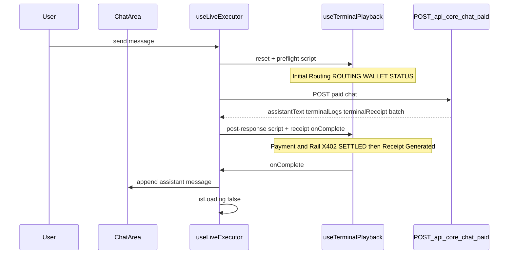

# Intelligence Terminal — Live Settlement & Logic Feed (playback)

This document describes how the **right-hand terminal rail** on [`/intelligence-terminal`](../src/app/intelligence-terminal/page.tsx) renders paid-chat and engine WebSocket data: **Figma-style sections**, **gradual line-by-line reveal**, and **assistant reply deferred** until the feed finishes.

For custodial x402 architecture and API contracts, see [core-custodial-x402.md](./core-custodial-x402.md). For engine WebSocket frame shapes (legacy path), see [daemon-integration.md](./daemon-integration.md).

## Goals

1. **Real data only** — Logs and receipts come from Core `terminalLogs` / `terminalReceipt`, engine WS frames, wallet/subnet picker context. No fake ZK/Solana/proof lines unless present in the payload.
2. **Gradual reveal** — HTTP/WS may return instantly; the UI **replays** entries over ~3–5s so the rail feels live.
3. **Reply after terminal** — The chat **assistant message** appears only after the last log line and **Receipt Generated** bar are shown (not when HTTP returns).

## User-visible flow

While the terminal animates, the chat area keeps the **loading spinner** (`isLoading` stays true until `onComplete`). The user message is marked **sent** (`sendState: "ok"`) as soon as HTTP succeeds.

## UI (`terminal-panel.tsx`)

| Element | Behaviour |
|---------|-----------|
| Subtitle | **Live Settlement & Logic Feed** |
| Log rows | Section headers (e.g. Initial Routing, Payment & Rail), **timestamp pill** (`HH:mm:ss.SSS` at reveal time), bold **label**, grey **detail** |
| Receipt | Sticky **Receipt Generated** bar (provider, timestamp, cost, Verified); chevron expands full receipt + router reasoning + Copy JSON |
| Mobile | Same feed inside **Live Settlement & Logic Feed** collapsible under the chat transcript |

## Client modules

| File | Role |
|------|------|
| [`src/lib/hooks/use-terminal-playback.ts`](../src/lib/hooks/use-terminal-playback.ts) | `displayedLogs`, `displayedReceipt`, `isRevealing`; `playScript`, `appendThrottled`, `reset`; `onComplete` when playback ends |
| [`src/lib/build-terminal-script.ts`](../src/lib/build-terminal-script.ts) | Builds log scripts from wallet, subnet picker, server logs, receipt |
| [`src/lib/hooks/use-live-executor.ts`](../src/lib/hooks/use-live-executor.ts) | Wires playback into paid chat and WS; defers assistant append to `onComplete` |

### Playback timing

- Default budget: **4000ms** total for a script (`totalDurationMs`), split across lines (`min(500ms, 4000 / n)` per line, floor 120ms).
- **Receipt:** shown **400ms** after the last log line (`receiptDelayMs`).
- **Timestamps:** stamped at **reveal time** (not server batch time) so the feed looks live.
- **WebSocket:** `appendThrottled` enforces ~**280ms** minimum gap between frames so bursts do not flash.

### Script sections (client-derived)

| Section | Source |
|---------|--------|
| **Initial Routing** (preflight) | Auto routing vs forced subnet label; custodial wallet address/USDC; backend ready status |
| **Initial Routing** (post-response) | `terminalReceipt.subnet`, `intent`, `reasoning` |
| **Payment & Rail** | Core `terminalLogs` (`X402`, `SETTLED`, `ERROR`) unchanged |
| **Execution** | WS-only: `toLog(frame)` from engine events |

Dedupe uses `section|label|detail` prefix so preflight lines are not repeated when the post-response script runs (`mode: "append"` skips already-shown keys).

## Paid chat path (`NEXT_PUBLIC_USE_TERMINAL_BACKEND_X402=true`)

1. **Send** — `startTerminalPreflight()` → `buildPreflightScript(scriptContext)`.
2. **HTTP success** — Mark user message `ok`; `playScript(buildPostResponseScript(...), receipt, { mode: "append", revealReceiptAfter: true, onComplete })`.
3. **`onComplete`** — Append assistant message, set `x402Phase` settled, resolve promise so `handleSend` clears `isLoading`.

Core still returns the full batch in one response; only the **UI** staggers display.

## Engine WebSocket path (Core paid chat off)

1. Each WS frame → `appendThrottled(toLog(frame))`.
2. On **`result`** — `queueReceiptAfterThrottle(receipt, delay, deliverAssistant)`; assistant text is buffered until receipt playback completes.

## Cancellation

- **New send**, **new chat**, **session switch**, or **archive/delete** → `resetTerminalPlayback()` clears timeouts and pending `onComplete` callbacks so stale lines/replies do not leak.

## Related env

| Variable | Effect on feed |
|----------|----------------|
| `NEXT_PUBLIC_USE_TERMINAL_BACKEND_X402` | Paid chat uses Core batch + script builder; WS path uses throttled frames |
| (none for timing) | Intervals are fixed in `use-terminal-playback.ts`; adjust constants there if product wants faster/slower reveal |

## Manual test checklist

1. Open `/intelligence-terminal` with Core paid chat enabled.
2. Send a message: preflight lines appear, then Payment & Rail, then **Receipt Generated**, then assistant reply.
3. Confirm receipt fields match live data (subnet, cost, x402 explorer link).
4. Send again quickly: previous playback cancels without duplicate lines.
5. Optional: `NEXT_PUBLIC_USE_TERMINAL_BACKEND_X402=false` — WS logs throttle; reply after receipt.
